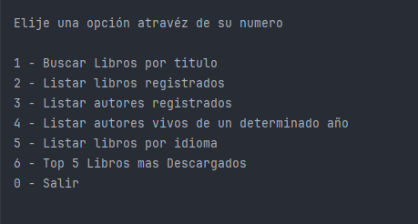
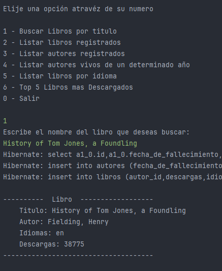
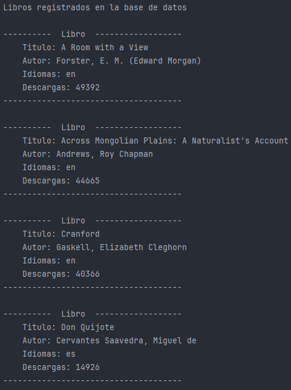
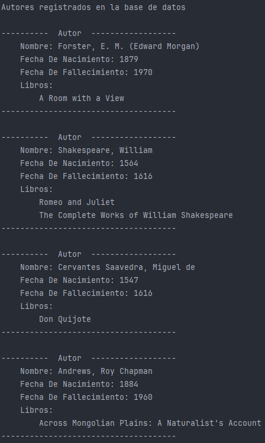
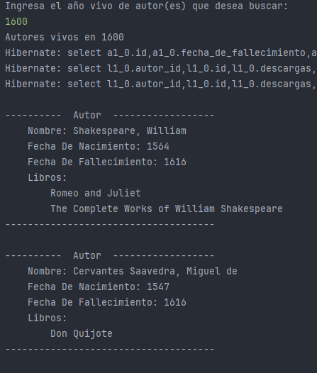
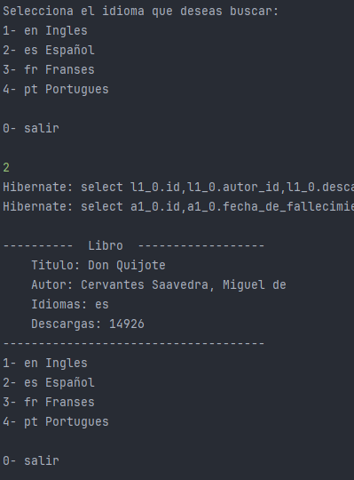
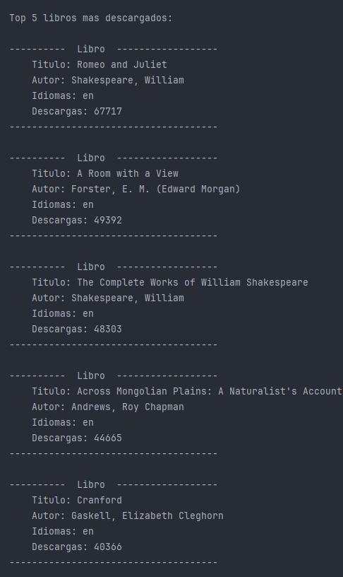

# __Literatura__
 


## Challenge Literalura
Esta es una aplicación de consola a que no cuenta con una interfaz gráfica. Esta aplicacion permite buscar libros de una API obteniendo información de los mismos para guardar en una base de datos de PostgreQL.

## Funcionalidades
Posee un menú con las opciones de búsquedas más destacadas:


1. ___Buscar libro por título___:  Busca libros de la API, obtiene los datos del libro y guarda los libros en la base de datos.
   

2. ___Listar libros registrados___: Obtiene los libros guardados en la base de datos y los muestra por la consola.
   
3. ___Listar autores registrados___: Obtiene los autores guardados en la base de datos y los muestra por la consola.
   
4. ___Listar autores vivos en un determinado año___: Lista los autores vivos en el año que se pide.
   
5. ___Listar libros por idioma___: Obtiene los libros guardados por el idioma del libro que pueden ser (ES, EN, FR, PT).
   
6. ___Top 5 libros más descargados___: Muestra los 5 libros más descargados.
   
0. ___Salir___: sale de la aplicación.

## Tecnoligías utilizadas

- 
- 
- 

## Acceder al proyecto
### Requisitos

- Java 17
- Spring Boot 3.2.4
- PostgreSQL
- Maven

### Instalación

1. Clona el repositorio:
    ```
    git clone https://github.com/Sergio-Alba/Literatura.git
    cd Literatura
    ```

2. Configura la base de datos PostgreSQL y actualizar los datos de:
`application.properties`.

3. Ejecutar la aplicación.

## API

La aplicación utiliza la API de Gutendex para obtener información sobre los libros. Más información sobre la API está disponible en [Gutendex API](https://gutendex.com).


## Creditos 
Desarrolado por __Sergio Alba__


